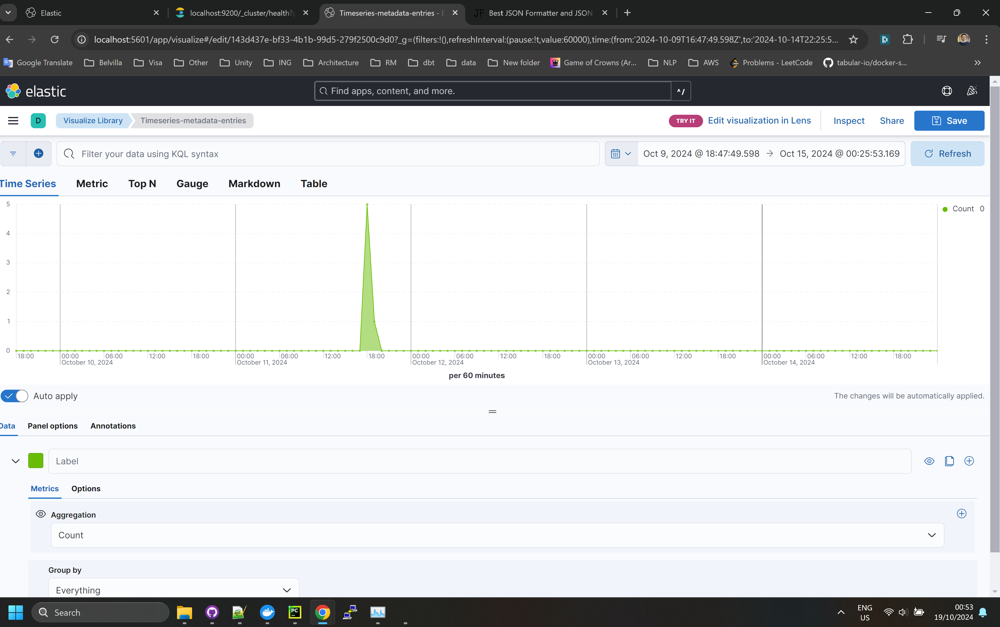

# Elasticsearch and Kibana Setup with Docker Compose

This repository provides a setup for **Elasticsearch** and **Kibana** using Docker Compose. It includes the generation of a **service account token** for Kibana, ensuring secure communication between the two services.

## Prerequisites

Make sure you have the following installed on your machine:
- Docker
- Docker Compose
- ElasticSearch Python client 
```bash
    python -m pip install elasticsearch)
```
## Services Overview

- **Elasticsearch**: Version `8.15.3`, configured as a single-node setup with memory limits set to 2GB.
- **Kibana**: Version `8.15.3`, using a service account token to authenticate with Elasticsearch.

## Setup Instructions

### 1. Configure the Setup

- Unpack the source code and following should be the directory structure:
```
./data
./data/A1
./local_tokens
./docker-compose.yml
./Dockerfile
./elasticsearch-init.sh
./my_elastic_client.py
./query-config.json
./Readme.md
./Timeseries-metadata-entries.png
```

### 3. Start the Docker Containers

Run the following command to build and start the services:

```bash
docker-compose up --build -d
```

### 4. Verify the Setup

#### `elasticsearch-init.sh`
- This script waits for Elasticsearch to fully start and generates a service account token for Kibana under ./local_tokens.
- This setup generates a service account token for Kibana using Elasticsearch's built-in tool, and the token is stored in a shared volume between the Elasticsearch and Kibana containers.
- This service token is then also used by elasticsearch python client.

#### Check Elasticsearch Health

Once the services are running, you can check the health of your Elasticsearch cluster by accessing:

```
http://localhost:9200/_cluster/health?pretty
```

#### Check Kibana

Check Kibana connectivity with Elastic, go to above ```http://localhost:5601``` and go to dev tools on the home page. If you send ```GET _cat/indices?v```, you should be able to Elastic connection status.

#### Verify & customize the python script configuration
```json

...
"upload_config":[
    {
      "is_enabled":true,
      "name":"upload_1",
      "input_directory": "./data/A1/",
      "error_directory": "./data/error/",
      "index_name": "face-metadata"
    }
  ]
...
```
Each object in upload config can be used to upload data with files/index combination.Most of the properties are self-explanatory. Following are some important properties:
```is_enabled```: The data will not be uploaded if disabled
```index_name```: Elastic index name to upload data to

```json
...
  "search_config":[
    {
      "is_enabled":false,
      "name":"search_2",
      "output_directory": "./data/out/",
      "index_name": "face-metadata",
      "filters": [
        {
          "date_path": "ResponseTimestamp",
          "start_date": "2024-10-11T16:10:00",
          "end_date": "2024-10-11T17:10:00"
        }
...
```
Similarly, each object in search_config allows distinct search and writes the result at the specified output directory.
```is_enabled```: The search will not be performed and results will not be saved if disabled
```index_name```: Elastic index name to perform search on

#### Run python client

Run ```python .\my_elastic_client.py``` 

#### Kibana Timeseries chart
